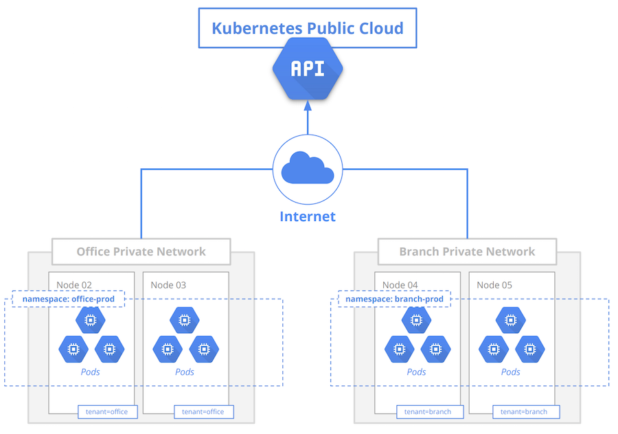
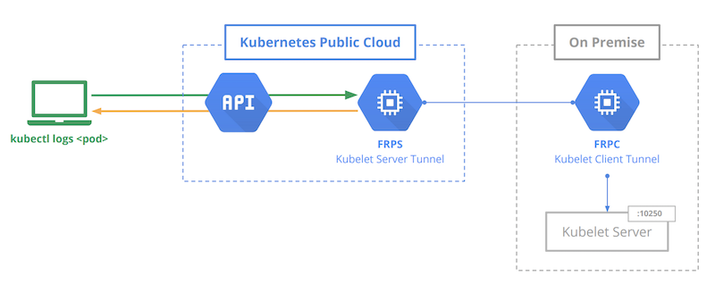

# AllSpark

AllSpark lets you connect to any Linux machine with a Kubernetes Control Plane over the internet.
You'll get the experience of managing bare metal or virtual servers like if they were in the Cloud.

> **Important:** Please note this software is experimental and should not be used for anything resembling a production workload.

# Key Features

- Works on any Linux machine with minimal setup
- Seamless integration, no need for complicated VPNs or firewall configuration.
- Manage your apps as if they were in the cloud.
- Expose apps to the internet using ingress resources.
- Node multi tenancy lets you group a set of nodes to a particular `tenant`.

# How it Works

On a typical Kubernetes installation you will be oriented to create your nodes over a private network,
this project does the opposity and will instruct you to connect your nodes over a public network.
In order for this to work all components must be configured to communicate with a public accessible API Server.

To join a node to AllSpark a simple `kubeadm join` is used, a node belongs to a particular `tenant` identified by a label:
`allspark.sh/tenant=<tenantname>`. The api server is configured to use the [PodNodeSelector](https://kubernetes.io/docs/reference/access-authn-authz/admission-controllers/) admission controller which gives the ability for all pods of a particular namespace to be schedulled on a group of nodes matching a especific selector.

An operator manages [tunnels](https://github.com/fatedier/frp) for `tenants`, when the connection is established
it's possible to reach the nodes executing `exec`, `attach`, `logs` and `port-forward` commands.

Exposing applications could be performed using ingress resources, which also uses tunnels to proxy an app on a private node to the internet.

# Demo

A demo will be available soon!
